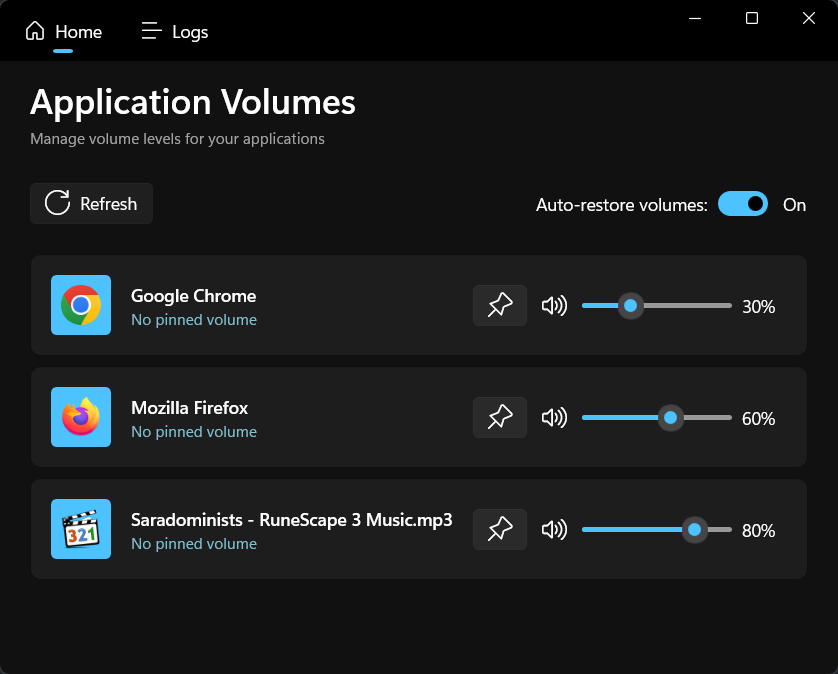
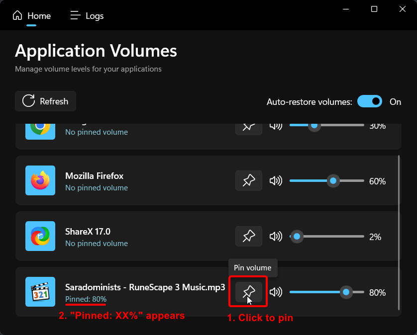
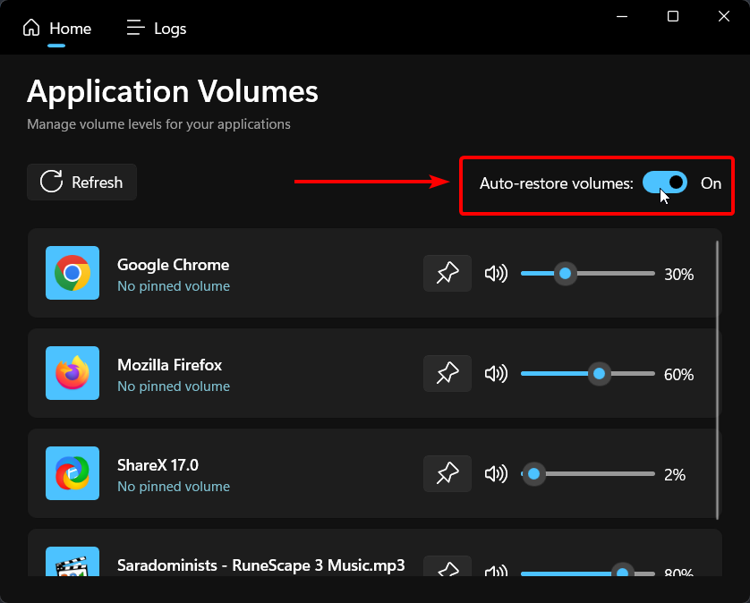
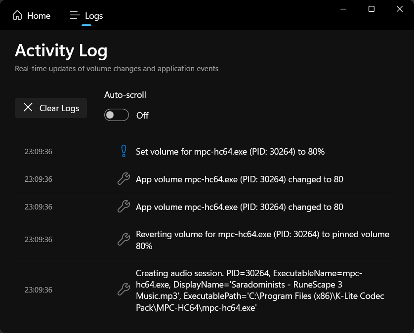
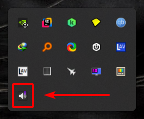
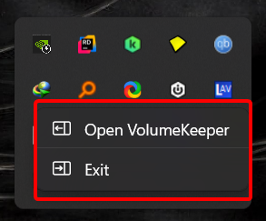

# VolumeKeeper

VolumeKeeper is a Windows app that remembers your volume settings for each application. Set your music player to 30%, your browser to 60%, and VolumeKeeper will remember and restore these levels automatically.

## What Does VolumeKeeper Do?

Ever adjust an app's volume perfectly, only to have it reset when you restart it? VolumeKeeper solves this problem by:

1. **Watching** for volume changes in your applications
2. **Remembering** the volume levels you set (when you "pin" them)
3. **Restoring** those exact levels when applications launch again

 

<em>Main window showing application volumes</em>

## Key Features

- **Pin Volume Levels** - Save any app's volume with one click
- **Auto-Restore** - Volumes automatically restore when apps launch
- **Simple Interface** - Clean, modern design that's easy to use
- **Activity Log** - See exactly what VolumeKeeper is doing in real-time
- **System Tray** - Quick access from your taskbar
- **Lightweight** - Runs quietly in the background

## Download

**[⬇️ Download the Latest Release](https://github.com/yourusername/VolumeKeeper/releases/latest)**

Get the newest version of VolumeKeeper with all the latest features and improvements.

## Getting Started

### What You Need

- Windows 10/11

### Installing VolumeKeeper

1. Download the latest release from the [releases page](https://github.com/yourusername/VolumeKeeper/releases)
2. Extract the ZIP file to any folder on your computer
3. Run `VolumeKeeper.exe`
4. VolumeKeeper will appear in your system tray (look for the icon near your clock)

## How to Use VolumeKeeper

### Pinning a Volume

1. Open an application that plays sound (music player, browser, game, etc.)
2. Adjust its volume to your preferred level using the slider in VolumeKeeper
3. Click the **Pin** button (pin icon) next to the application
4. That's it! The volume is now saved

 

<em>Click the pin button to save an application's volume level</em>

 

The app will show "Pinned: XX%" below its name so you know it's saved.

### How Auto-Restore Works

When auto-restore is enabled (it is by default):

1. You pin a volume for an application
2. Next time that application launches, VolumeKeeper automatically sets it to the pinned volume
3. Check the activity log to see when volumes are restored

You can turn auto-restore on or off with the toggle switch in the Home tab.

 

<em>Enable or disable auto-restore with a simple toggle</em>

### Understanding the Interface

#### Home Tab

The Home tab shows all your applications with audio:

- **Application icon and name** - Visual identification of each app
- **Pinned volume display** - Shows if a volume is pinned and what level
- **Volume slider** - Adjust volume (0-100%)
- **Mute button** - Speaker icon to mute/unmute
- **Pin button** - Pin icon to save the current volume
- **Revert button** - Undo icon (appears when you change a pinned volume)
- **Refresh button** - Updates the list of applications
- **Auto-restore toggle** - Enable/disable automatic volume restoration

#### Logs Tab

The Logs tab shows everything VolumeKeeper does:

- When volumes are changed
- When volumes are pinned or unpinned
- When applications launch and volumes are restored
- Any errors or important messages

Use the **Clear Logs** button to start fresh, and enable **Auto-scroll** to always see the latest activity.

 

<em>Real-time activity log showing all volume changes and events</em>

### Working with the Pin Button

The pin button has smart behavior:

- **Not pinned yet?** Click to pin the current volume
- **Already pinned at this volume?** Click to unpin (remove the saved setting)
- **Pinned at a different volume?** Click to update to the new volume

### Reverting Changes

If you change a pinned volume but want to go back:

1. The **Revert** button (undo icon) will appear
2. Click it to instantly restore the pinned volume
3. The revert button disappears once volumes match again

### Muting Applications

Click the speaker icon next to any slider to mute or unmute that application. VolumeKeeper remembers the volume before muting, so unmuting restores it perfectly.

## System Tray

VolumeKeeper lives in your system tray for easy access:

- **Left-click** the icon to open the main window
- **Right-click** the icon for quick options:
  - Open VolumeKeeper
  - Exit

<em>VolumeKeeper sits in your system tray for easy access</em>

<em>Right-click the system tray icon for quick access</em>

## Tips & Tricks

- **Quick pin**: Adjust volume with Windows Volume Mixer, then open VolumeKeeper and pin it
- **Multiple instances**: If an app runs multiple windows, VolumeKeeper applies the pinned volume to all of them
- **Check the logs**: The activity log helps you understand what's happening and troubleshoot issues
- **Refresh when needed**: Click Refresh if an app doesn't appear right away

## Privacy

VolumeKeeper works completely offline. Your volume settings never leave your computer. Everything is stored locally in your Windows user profile.

## Troubleshooting & Advanced Topics

For troubleshooting help, data storage locations, and technical details, see the [Technical Guide](docs/TECHNICAL_GUIDE.md).

## License

VolumeKeeper is released under the MIT License. See the [LICENSE](LICENSE) file for details.

## Support

Having problems or have suggestions?

1. Check the [Technical Guide](docs/TECHNICAL_GUIDE.md) for troubleshooting
2. Look at the activity log (Logs tab) for error messages
3. Try restarting VolumeKeeper
4. Report issues on GitHub with details from the activity log
